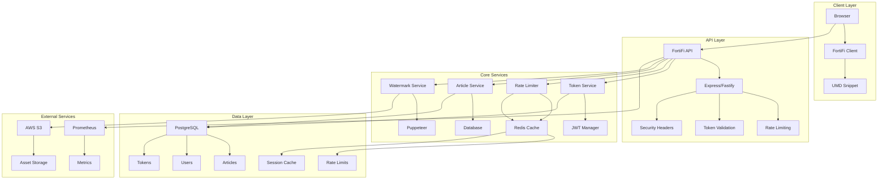
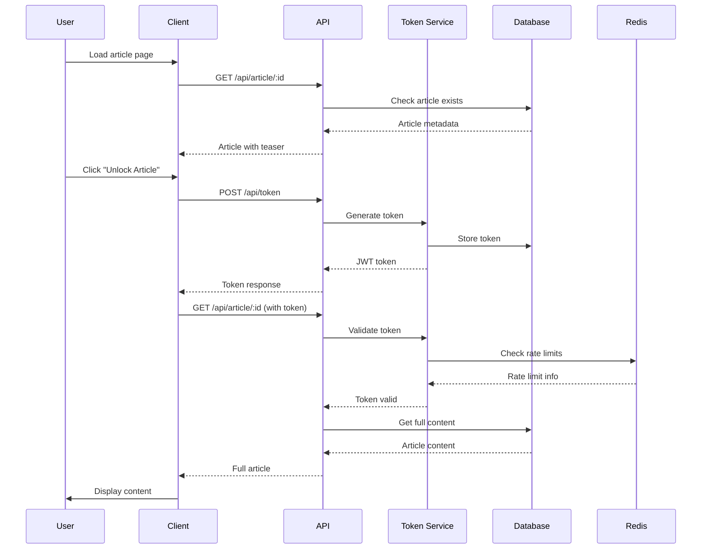
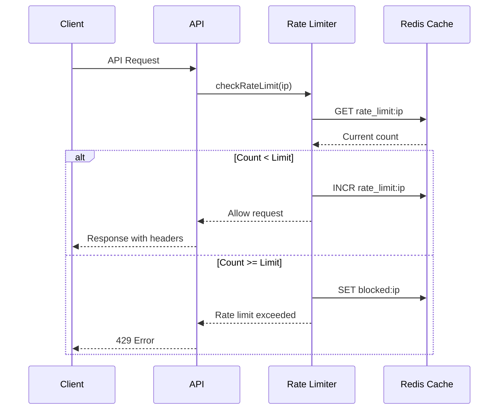
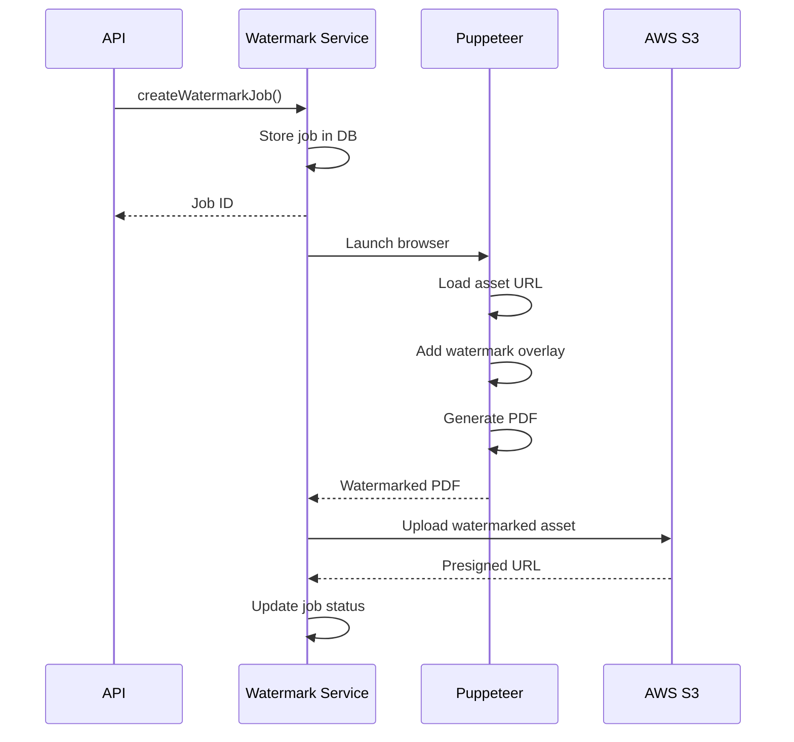

# FortiFi Architecture

## Overview

FortiFi is a comprehensive paywall hardening toolkit designed to prevent CSS/DOM bypasses through server-side enforcement, short-lived tokens, and advanced security features.

## System Architecture



## Core Components

### 1. Core Middleware (`@fortifi/core`)

**Purpose**: Provides the foundational middleware for paywall enforcement.

**Key Features**:
- JWT token generation and validation
- Rate limiting with Redis
- Security headers and CORS
- Express and Fastify support

**Architecture**:
```
Core Middleware
├── JWTManager
│   ├── generateToken()
│   ├── verifyToken()
│   └── isTokenExpired()
├── RateLimiter
│   ├── checkRateLimit()
│   ├── blockIp()
│   └── getRateLimitInfo()
├── RedisClient
│   ├── connect()
│   ├── get/set/del()
│   └── expire()
└── FortiFiMiddleware
    ├── validateToken()
    ├── rateLimit()
    └── security()
```

### 2. Client Library (`@fortifi/client`)

**Purpose**: Lightweight browser client for seamless integration.

**Key Features**:
- UMD build for easy integration
- Token management
- DOM manipulation
- Error handling

**Architecture**:
```
Client Library
├── FortiFiClient
│   ├── init()
│   ├── requestAccess()
│   └── loadContent()
├── FortiFiAPI
│   ├── requestToken()
│   ├── fetchArticleContent()
│   └── makeRequest()
└── FortiFiDOM
    ├── updateContent()
    ├── showCTA()
    └── updateMetadata()
```

### 3. Cloud API (`@fortifi/cloud`)

**Purpose**: SaaS-ready API service with full feature set.

**Key Features**:
- Fastify-based API
- PostgreSQL with Prisma ORM
- Redis caching
- Watermarking service
- Prometheus metrics

**Architecture**:
```
Cloud API
├── Routes
│   ├── Token Routes
│   ├── Article Routes
│   └── Watermark Routes
├── Services
│   ├── ArticleService
│   ├── TokenService
│   ├── RateLimitService
│   └── WatermarkService
├── Database
│   ├── Users
│   ├── Articles
│   ├── Tokens
│   └── RateLimits
└── External
    ├── Redis Cache
    ├── AWS S3
    └── Prometheus
```

## Data Flow

### 1. Article Access Flow



### 2. Rate Limiting Flow



### 3. Watermarking Flow



## Security Architecture

### 1. Token Security

- **Short-lived tokens**: 60-second TTL
- **Article-specific**: Tokens tied to specific articles
- **Server-side validation**: All tokens validated on server
- **One-time use**: Tokens marked as used after validation

### 2. Rate Limiting

- **Multi-layer protection**: IP and user-based limits
- **Adaptive blocking**: Temporary IP blocking for violations
- **Redis-based**: Fast, distributed rate limiting
- **Configurable**: Customizable limits per endpoint

### 3. Content Protection

- **Server-side delivery**: Content only served after validation
- **Watermarking**: Optional per-user asset watermarking
- **Presigned URLs**: Time-limited access to assets
- **Content integrity**: Checksums and validation

## Scalability Considerations

### 1. Horizontal Scaling

- **Stateless API**: No server-side session storage
- **Redis clustering**: Distributed caching
- **Database sharding**: Partition data by user/region
- **CDN integration**: Cache static assets

### 2. Performance Optimization

- **Connection pooling**: Database and Redis connections
- **Caching strategies**: Multi-level caching
- **Async processing**: Background watermarking jobs
- **Compression**: Gzip/Brotli compression

### 3. Monitoring and Observability

- **Prometheus metrics**: Request rates, errors, latency
- **Structured logging**: JSON logs with correlation IDs
- **Health checks**: Service health monitoring
- **Alerting**: Automated alerting on anomalies

## Deployment Architecture

### 1. Development Environment

```yaml
Services:
  - PostgreSQL (Docker)
  - Redis (Docker)
  - API (Local)
  - Demo (Local)
```

### 2. Production Environment

```yaml
Load Balancer:
  - Nginx/HAProxy
  
API Tier:
  - Multiple API instances
  - Auto-scaling groups
  
Data Tier:
  - PostgreSQL cluster
  - Redis cluster
  - S3 for assets
  
Monitoring:
  - Prometheus
  - Grafana
  - AlertManager
```

### 3. Kubernetes Deployment

```yaml
Namespaces:
  - fortifi-api
  - fortifi-demo
  - fortifi-monitoring

Resources:
  - Deployments
  - Services
  - ConfigMaps
  - Secrets
  - Ingress
```

## Technology Stack

### Backend
- **Runtime**: Node.js 18+
- **Framework**: Fastify (API), Express (Demo)
- **Database**: PostgreSQL 15+
- **Cache**: Redis 7+
- **ORM**: Prisma
- **Authentication**: JWT

### Frontend
- **Build Tool**: Webpack
- **Language**: TypeScript
- **Testing**: Playwright
- **Format**: UMD

### DevOps
- **Containerization**: Docker
- **Orchestration**: Kubernetes
- **CI/CD**: GitHub Actions
- **Monitoring**: Prometheus + Grafana
- **Logging**: Pino

### Security
- **Rate Limiting**: Redis-based
- **Input Validation**: Zod
- **Security Headers**: Helmet
- **CORS**: Configurable origins
- **Watermarking**: Puppeteer

## API Design

### RESTful Endpoints

```
GET    /health                    # Health check
POST   /api/token                 # Generate token
POST   /api/token/validate        # Validate token
DELETE /api/token                 # Revoke token
GET    /api/article/:id           # Get article
POST   /api/article               # Create article
PUT    /api/article/:id           # Update article
DELETE /api/article/:id           # Delete article
GET    /api/articles              # List articles
POST   /api/watermark             # Create watermark job
GET    /api/watermark/:jobId      # Get watermark status
```

### Error Handling

```json
{
  "error": "Error message",
  "code": "ERROR_CODE",
  "details": {
    "retryAfter": 60
  }
}
```

### Rate Limiting Headers

```
X-RateLimit-Limit: 100
X-RateLimit-Remaining: 95
X-RateLimit-Reset: 2024-01-15T11:00:00Z
```

## Future Enhancements

### 1. Advanced Security
- **Machine Learning**: Anomaly detection
- **Behavioral Analysis**: User pattern analysis
- **Geolocation**: Location-based restrictions
- **Device Fingerprinting**: Device-based tracking

### 2. Performance
- **Edge Computing**: CDN-based processing
- **WebAssembly**: Client-side processing
- **Streaming**: Real-time content delivery
- **Caching**: Advanced caching strategies

### 3. Features
- **Analytics**: Detailed usage analytics
- **A/B Testing**: Content experimentation
- **Personalization**: User-specific content
- **Multi-tenant**: SaaS multi-tenancy

---

This architecture provides a solid foundation for a scalable, secure, and maintainable paywall hardening solution.
